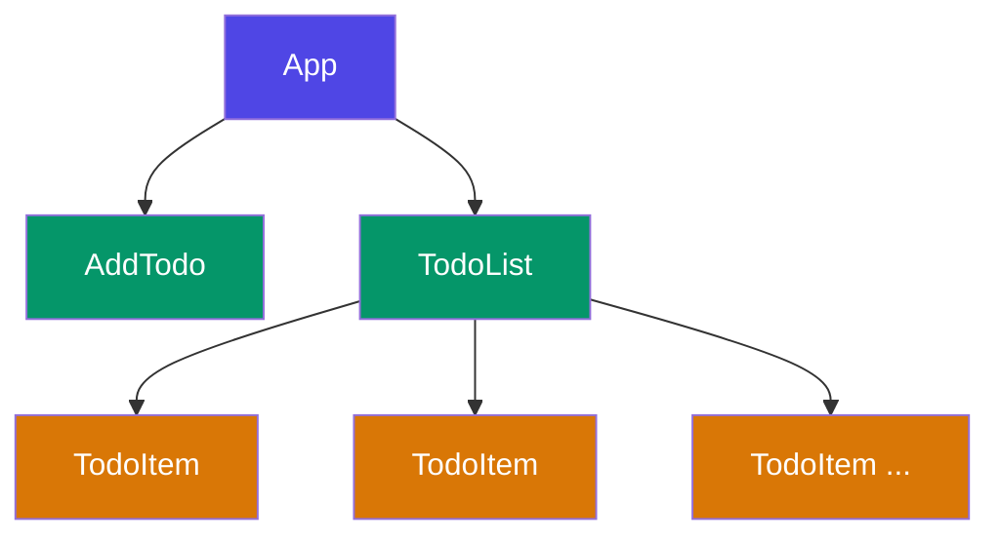
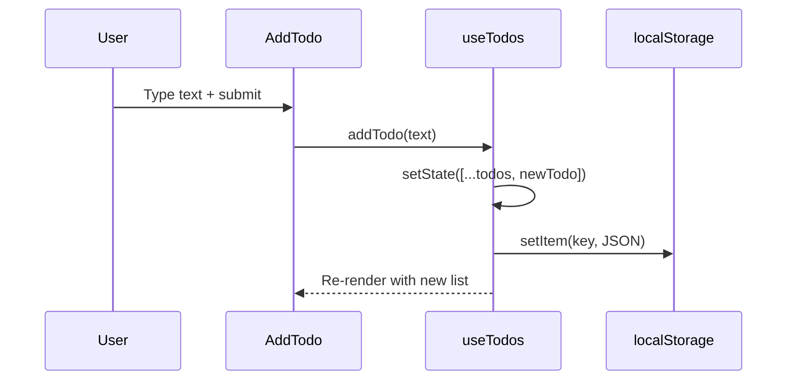
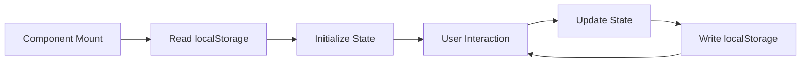

# Architecture

This document describes the component architecture and data flow of the todo app.

## Component Tree

## Data Flow

## Source Files

Each component lives in its own file within [[src/]]:

- [[App.tsx]] — Root component that wires everything together
- [[TodoList.tsx]] — Receives the todo array and renders sorted items
- [[TodoItem.tsx]] — Individual todo with toggle checkbox and delete button
- [[AddTodo.tsx]] — Controlled input form for creating new todos
- [[useTodos.ts]] — Custom hook managing state and persistence

## State Management

The app uses a single `useState` hook inside `useTodos`. There is no external state library — React's built-in state is sufficient for this scale.

> [!note]
> The `useTodos` hook follows the **custom hook pattern**: encapsulate related state and effects, return a clean API. See [[docs/features#Code Blocks]] for the TypeScript interface.

## Persistence

Todos are serialized to `localStorage` on every state change via a `useEffect`. On mount, the hook reads from storage to restore previous state:

> [!tip]
> Open DevTools → Application → Local Storage to inspect the persisted data.
