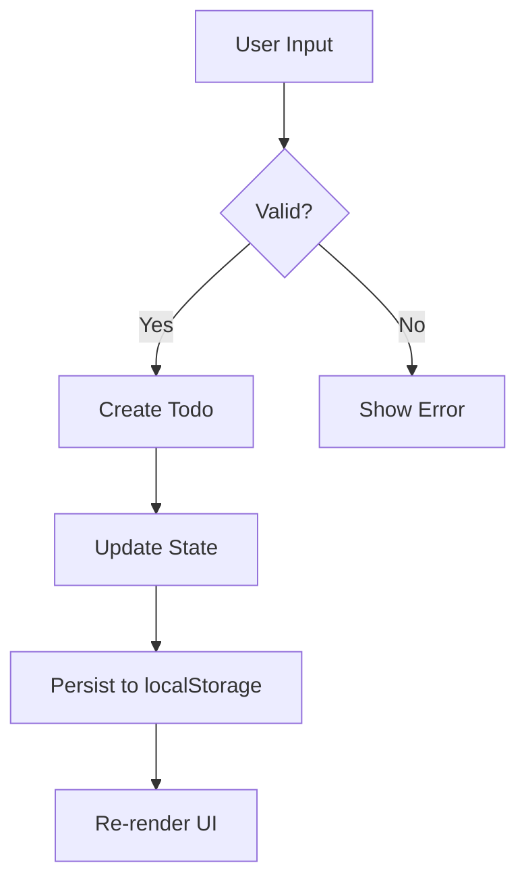

# Feature Showcase

This page demonstrates every markdown feature that Gitian supports. Use it as a reference or a test page.

## Callouts

Gitian supports all Obsidian callout types:

> [!note]
> This is a **note** callout. Use it for general information.

> [!tip]
> This is a **tip** callout. Use it for helpful suggestions.

> [!warning]
> This is a **warning** callout. Use it for things that could go wrong.

> [!danger]
> This is a **danger** callout. Use it for critical warnings.

> [!example]
> This is an **example** callout. Use it for code examples or demonstrations.

> [!quote]
> This is a **quote** callout. Use it for quotations or citations.
> — Someone wise

> [!info]
> This is an **info** callout. Use it for supplementary information.

> [!abstract]
> This is an **abstract** callout. Use it for summaries.

## Math

Gitian renders math using KaTeX.

### Inline Math

The quadratic formula is $x = \frac{-b \pm \sqrt{b^2 - 4ac}}{2a}$ and Euler's identity is $e^{i\pi} + 1 = 0$.

### Display Math

$$
\sum_{n=1}^{\infty} \frac{1}{n^2} = \frac{\pi^2}{6}
$$

$$
\int_{0}^{\infty} e^{-x^2} dx = \frac{\sqrt{\pi}}{2}
$$

## Tables

GFM tables with column alignment:

| Feature             | Status  | Priority |
| :------------------ | :-----: | -------: |
| Callouts            |  Done   |     High |
| Math (KaTeX)        |  Done   |   Medium |
| Mermaid diagrams    |  Done   |   Medium |
| Wikilinks           |  Done   |     High |
| ~~Legacy renderer~~ | Removed |        — |

## Wikilinks

Gitian supports Obsidian-style wikilinks in several formats:

- Basic: [[architecture]]
- With display text: [[architecture|Architecture Guide]]
- With heading anchor: [[getting-started#Prerequisites]]
- Cross-vault: [[App.tsx]]

## Strikethrough

This text has ~~strikethrough~~ applied to it. The ~~legacy renderer~~ in the table above also uses it.

## Code Blocks

### TypeScript

```typescript
interface Todo {
  id: string;
  text: string;
  completed: boolean;
  createdAt: number;
}

function createTodo(text: string): Todo {
  return {
    id: crypto.randomUUID(),
    text,
    completed: false,
    createdAt: Date.now(),
  };
}
```

### Python

```python
from dataclasses import dataclass, field
from datetime import datetime
from uuid import uuid4

@dataclass
class Todo:
    text: str
    id: str = field(default_factory=lambda: str(uuid4()))
    completed: bool = False
    created_at: datetime = field(default_factory=datetime.now)

    def toggle(self) -> None:
        self.completed = not self.completed
```

### Rust

```rust
use serde::{Deserialize, Serialize};
use uuid::Uuid;

#[derive(Debug, Serialize, Deserialize)]
struct Todo {
    id: Uuid,
    text: String,
    completed: bool,
    created_at: i64,
}

impl Todo {
    fn new(text: impl Into<String>) -> Self {
        Self {
            id: Uuid::new_v4(),
            text: text.into(),
            completed: false,
            created_at: chrono::Utc::now().timestamp(),
        }
    }
}
```

### Go

```go
package todo

import (
	"time"

	"github.com/google/uuid"
)

type Todo struct {
	ID        string    `json:"id"`
	Text      string    `json:"text"`
	Completed bool      `json:"completed"`
	CreatedAt time.Time `json:"created_at"`
}

func New(text string) Todo {
	return Todo{
		ID:        uuid.NewString(),
		Text:      text,
		Completed: false,
		CreatedAt: time.Now(),
	}
}

func (t *Todo) Toggle() {
	t.Completed = !t.Completed
}
```

### SQL

```sql
CREATE TABLE todos (
    id         UUID PRIMARY KEY DEFAULT gen_random_uuid(),
    text       TEXT NOT NULL,
    completed  BOOLEAN NOT NULL DEFAULT false,
    created_at TIMESTAMPTZ NOT NULL DEFAULT now()
);

SELECT id, text, completed
FROM todos
WHERE completed = false
ORDER BY created_at DESC;
```

## Mermaid Diagram



## Nested Formatting

You can combine **bold**, _italic_, ~~strikethrough~~, and `inline code` freely. Even **bold with _nested italic_** works.

> Blockquotes can contain **formatted text**, `code`, and even math: $E = mc^2$
