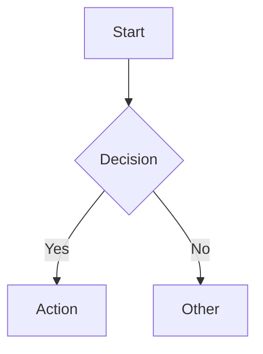

# Markdown Rendering

Gitian renders Obsidian-flavored markdown with extensions for wikilinks, callouts, diagrams, math, and syntax highlighting.

## Wikilinks

Link between docs using Obsidian-style wikilinks:

| Syntax | Description |
|--------|-------------|
| `[[page]]` | Link to a page by filename |
| `[[page\|display text]]` | Link with custom display text |
| `[[page#heading]]` | Link to a specific heading |
| `[[page#heading\|display]]` | Heading link with display text |

Wikilinks resolve across the entire repository — all docs directories are merged into a single namespace.

## Callouts

Obsidian-style callouts using blockquote syntax:

| Type | Use for |
|------|---------|
| `[!note]` | General information |
| `[!tip]` | Helpful suggestions |
| `[!warning]` | Potential issues |
| `[!danger]` | Critical warnings |
| `[!info]` | Supplementary info |
| `[!example]` | Code examples or demos |
| `[!quote]` | Quotations or citations |
| `[!abstract]` | Summaries |
| `[!todo]` | Task items |
| `[!bug]` | Bug reports |

Callouts support nested content, including code blocks and other callouts.

## Mermaid Diagrams

Code blocks with the `mermaid` language tag render as diagrams:



Supports flowcharts, sequence diagrams, class diagrams, state diagrams, and more.

## KaTeX Math

Inline math with `$...$` and display math with `$$...$$`:

- Inline: `$E = mc^2$`
- Display: `$$\sum_{n=1}^{\infty} \frac{1}{n^2} = \frac{\pi^2}{6}$$`

## Code Highlighting

Fenced code blocks with language tags get syntax highlighting. Supported languages include TypeScript, JavaScript, Python, Rust, Go, SQL, YAML, and many more.

## Frontmatter

YAML frontmatter at the top of markdown files is parsed and displayed:

```yaml
---
title: My Document
description: A brief summary
tags: [api, auth]
---
```

Frontmatter fields `detect_docs` and `detect_keywords` override project-level config for that specific doc file.

## GitHub Flavored Markdown

Full GFM support including:

- Tables with column alignment
- Strikethrough (`~~text~~`)
- Task lists (`- [x] done`, `- [ ] todo`)
- Autolinked URLs and references
